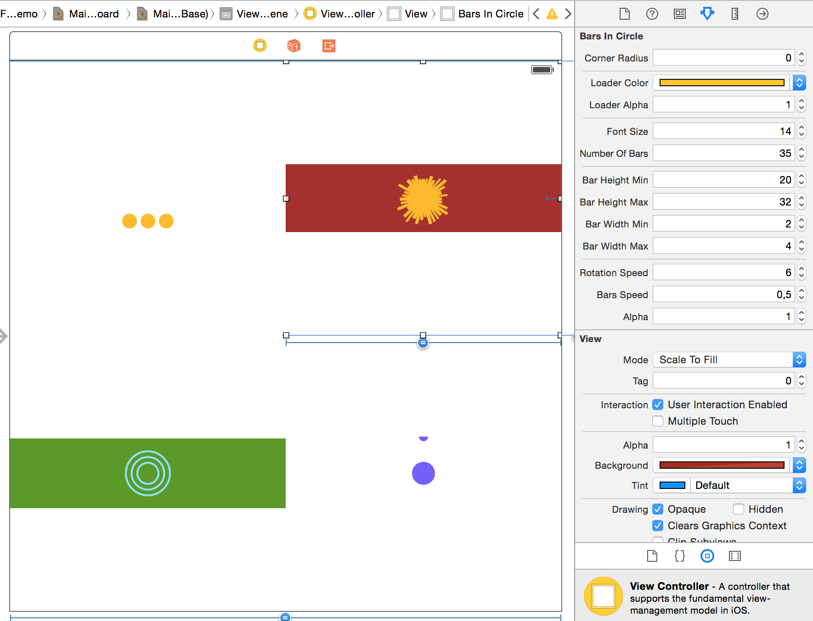
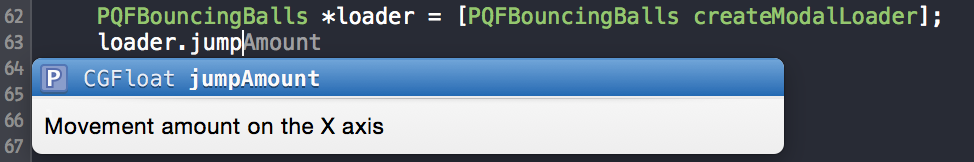
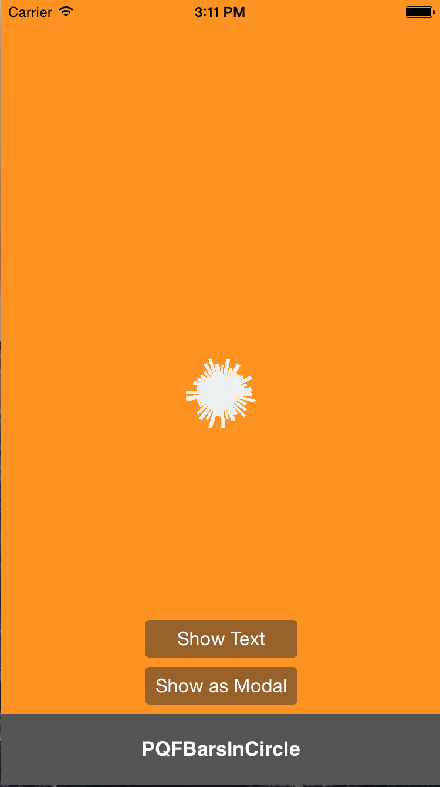
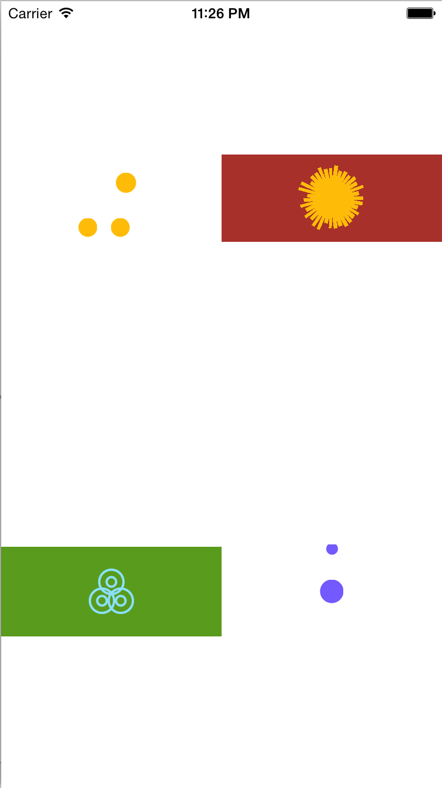

#PQFCustomLoaders 1.1.0

####Collection of highly customizable loaders for your iOS projects.

###Changelog
* **1.1.0** (24 May 2015)
	- **IB Designable properties** - Thanks **[@dfreniche](https://github.com/dfreniche)**!	
			
	- New **Inspectable Demo** with IBDesignable properties examples
	- Improvements
* **1.0.1** (9 May 2015)
	- **New Modal presentation**	
	- **New Loader** (PQFBallDrop)
	- New demo
	- New methods to create the loaders
	- All the properties are now with description
			
	- Fixed layout problems in some rare cases
	- Improvements
* **0.0.1** Initial version

Demo Apps
--------
___



Installation
--------
___

###CocoaPods

The easiest way to get started is to use [CocoaPods](http://cocoapods.org/). Just add the following line to your Podfile:

``` pod 'PQFCustomLoaders', '~> 1.1.0' ```

###Import the project
If you don't want to use (you should) ``CocoaPods``,  you can download this project, and add the files in the ``/PQFCustomLoaders`` folder to your existing project.

Quick Start
--------
___

####1. Import

The first thing is to import the main file. This file contain all the requiered imports that you are going to need. If you are planning to use only one loader, you can import only the required one, it is up to you.

```
#import <PQFCustomLoaders/PQFCustomLoaders.h>
```

####2. Create a loader:

For example, if you are going to add the ``PQFBouncingBalls`` Loader, you have to initialize it like this.
I recommend you to make a property in order to have a pointer to the loader for when you want to remove it.

```
@interface MyClass ()
...

@property (nonatomic, strong) PQFBouncingBalls *bouncingBalls;

...
@end
```
#####2.	1 In a view

```
@implementation MyClass
...

self.loader = [PQFBouncingBalls createLoaderOnView:self.view];

...
@end
```
In this example I am adding the loader to the main view, but you can add it to any UIView (or subclass)

#####2.	2 As a modal

```
@implementation MyClass
...

self.loader = [PQFBouncingBalls createModalLoader];

...
@end
```

####3. Customize it
You can customize this loaders a lot, in the following section (``Loader Styles``) you can see all the custom properties that you can change.

```
self.loader.jumpAmount = 50;
self.loader.zoomAmount = 20;
self.loader.separation = 20;
```
__The only properties that can be changes once the loader is on screen are:__

* cornerRadius
* loaderColor
* loaderAlpha
* backgroundColor

But it is __highly recommended__ to change them before showing


####4. Show it!
When the loader is initialized, it is going to be added to the subviews of the view that you choose. But it is going to be with alpha 0.0 and with no animations activated (so no memory problems ;) ). 

```
[self.loader showLoader];
```
When you use the ``show`` method, you are making it visible and activating the animations

####5. Remove it
If you are not going to use it anymore, just remove it

```
[self.loader removeLoader]
```
This method is going to remove it from it superview.


###Methods you can use:

```
+ (instancetype)showModalLoader;
+ (instancetype)showLoaderOnView:(UIView *)view;
+ (instancetype)createModalLoader;
+ (instancetype)createLoaderOnView:(UIView *)view;
+ (void)removeAllLoadersOnView:(UIView *)view;

- (void)showLoader;
- (void)removeLoader;

DEPRECATED METHODS:

- (instancetype)initLoaderOnView:(UIView *)view  ("Use '+createLoader:onView:'");
- (void)remove 	                                 ("Use 'removeLoader'");
- (void)show                                     ("Use 'showLoader'");
- (void)hide                                     ("Use 'removeLoader'");


```


Loader Styles
--------

###PQFBouncingBalls


####__Properties:__
** Text label of the Loader (Hidden if text is nil) :** label;

** Corner radius of the Loader background :** cornerRadius;

** Color of the Loader :** loaderColor;

** Alpha of the loader :** loaderAlpha;

** Diameter of the bouncing balls :** diameter;

** Movement amount on the X axis :** jumpAmount;

** Separation between the bouncing balls :** separation;

** Ball added size when jumping :** zoomAmount;

** Duration of each animation :** duration;

** Size of the label text :** fontSize;

** Alpha of the hole view :** alpha;


###PQFBarsInCircles


####__Properties:__
** Text label of the Loader (Hidden if text is nil) :** label;

** Corner radius of the Loader background :** cornerRadius;

** Color of the Loader :** loaderColor;

** Alpha of the loader :** loaderAlpha;

** Duration of each animation :** duration;

** Size of the label text :** fontSize;

** Number of rotating bars :** numberOfBars;

** Minimum height of the bars :** barHeightMin;

** Maximum height of the bars :** barHeightMax;

** Minimum width of the bars :** barWidthMin;

** Maximum width of the bars :** barWidthMax;

** Rotation speed in seconds (Less amount, more speed) :** rotationSpeed;

** Bar size speed in seconds (Less amount, more speed) :** barsSpeed;

** Alpha of the hole view :** alpha;

###PQFCirclesInTriangle


####__Properties:__
** Text label of the Loader (Hidden if text is nil) :** label;

** Corner radius of the Loader background :** cornerRadius;

** Color of the Loader :** loaderColor;

** Alpha of the loader :** loaderAlpha;

** Duration of each animation :** duration;

** Size of the label text :** fontSize;

** Number of circles to animate. 3 or 6 are the recommended values :** numberOfCircles;

** Maximum diameter of the circles :** maxDiam;

** Separation between the circles :** separation;

** Border width of the circles:** borderWidth;

** Delay between the animations :** delay;

** Alpha of the hole view :** alpha;

###PQFBallDrop


####__Properties:__
** Text label of the Loader (Hidden if text is nil) :** label;

** Corner radius of the Loader background :** cornerRadius;

** Color of the Loader :** loaderColor;

** Alpha of the loader :** loaderAlpha;

** Duration of each animation :** duration;

** Size of the label text :** fontSize;

** Maximum diameter of the circles :** maxDiam;

** Delay between the animations :** delay;

** Ball added size when droping :** amountZoom;

** Alpha of the hole view :** alpha;


Licenses
--------

All source code is licensed under the MIT License.

If you use it, i'll be happy to know about it.


###Pol Quintana - [@poolqf](https://twitter.com/poolqf)
